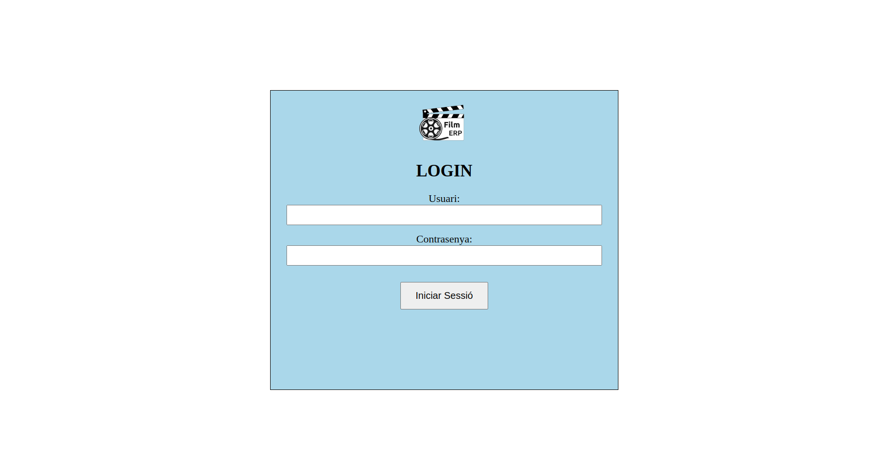
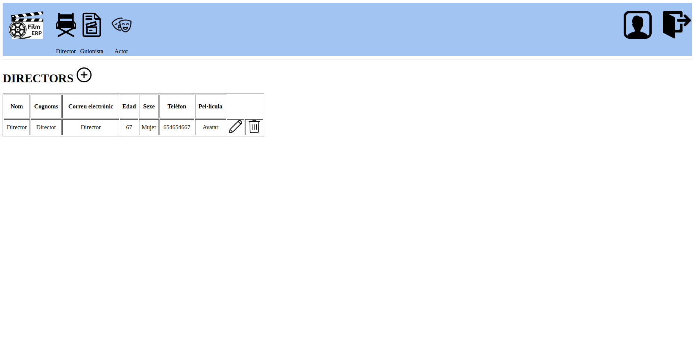
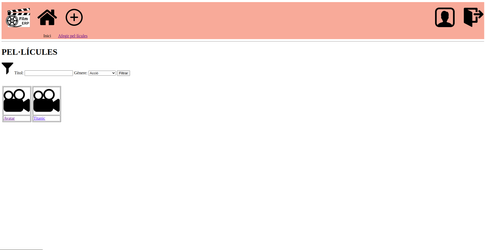

# FilmERP

L'aplicació tracta la producció cinematogràfica, especificament les pel·lícules. Amb aquesta pàgina es vol tenir una millor organització sobre les pel·lícules estrenades i els actors que les realitzen.

### Pantalles
,
,

### Memoria
Link a la memoria [aquí](https://docs.google.com/document/d/1hZQNKwx1ao709r6Xv91hsg92GRChtQ6kpxTdv97DXEg/edit#heading=h.2wxpd0f54ja0).

### Video DEMO
Link al video demo [aquí](https://drive.google.com/file/d/1Yche7BHqoA-K1zwfMQ8Il4Z89PRpfSsg/view?usp=drive_link). 
